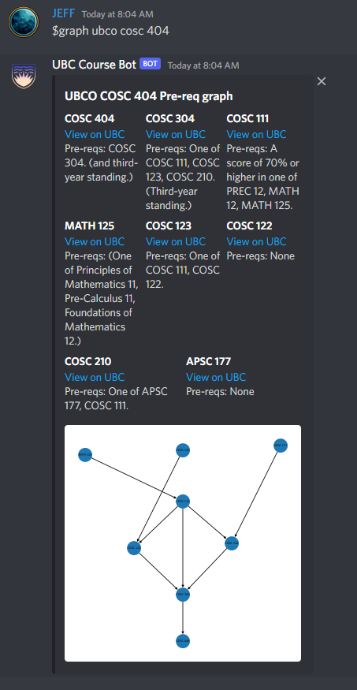
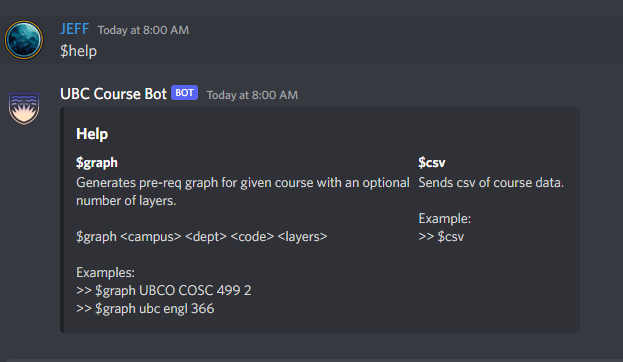

# UBC-Course-Bot
[Add this bot to your discord server](https://discord.com/api/oauth2/authorize?client_id=1008396649657278605&permissions=51200&scope=bot)
## How to run this code yourself
1. Install Python [here](https://www.python.org/downloads/).
2. Install packages, you might need to install pip [here](https://pip.pypa.io/en/stable/installation/)
    ```
    pip install selenium
    pip install pandas
    pip install discord
    pip install python-dotenv
    pip install networkx
    pip install matplotlib
    ```
3. Download the correct version of chromedriver for your system [here](https://chromedriver.chromium.org/downloads).
    * Chromedriver must be the same version as chrome on your device
    * Linux chromedriver for chrome is included in this repository but may be out of date
4. Follow [this guide](https://realpython.com/how-to-make-a-discord-bot-python/#how-to-make-a-discord-bot-in-python) to make a discord application and create your .env file.
5. Run Scrape.py to update the courses.csv file with current courses.
    * This can take around 20 minutes to scrape all the data
6. Run CourseBot.py to run the bot.

## Results



